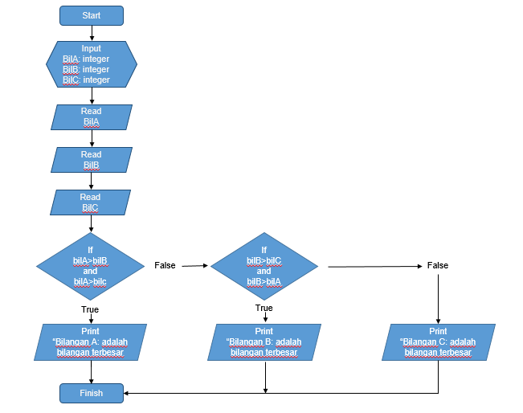
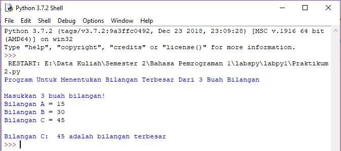
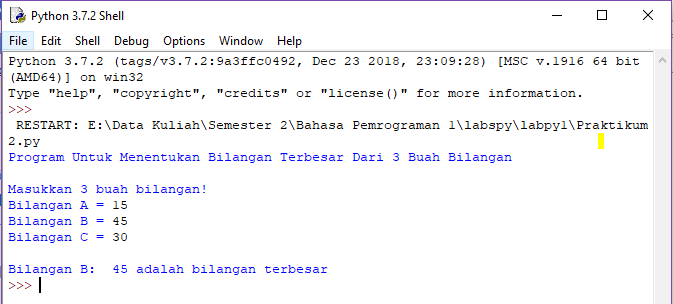

# Program Python: Menentukan Bilangan Terbesar Dari 3 Buah Bilangan

## Algoritma

* Masukkan 3 buah bilangan
* Melakukan proses penentuan variable mana yang memiliki bilangan terbesar
* Melakukan pencetakan hasil proses

## Pseudocode

* Start
* Input bilA, bilB, bilC
* Read bilA
* Read bilB
* Read bilC
* If bilA > bilB and bilA > bilC Then Print "Bilangan A: adalah bilangan terbesar"
* Elif, bilB > bilC dan bilB > Then Print "Bilangan B: adalah bilangan terbesar"
* Else, bilC Print "Bilangan C: adalah bilangan terbesar"

## Flowchart 

## Hasil Running Program

* **Kondisi Pertama**

* **Kondisi Kedua**

* **Kondisi Ketiga**

